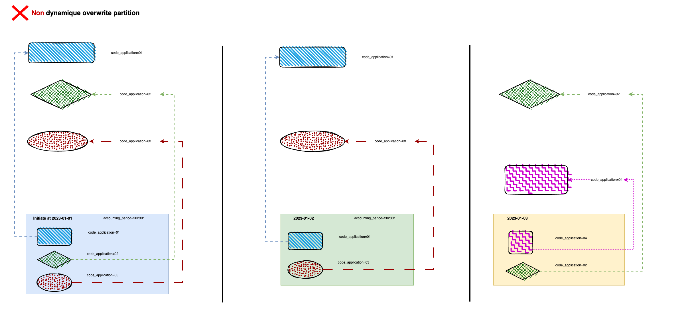
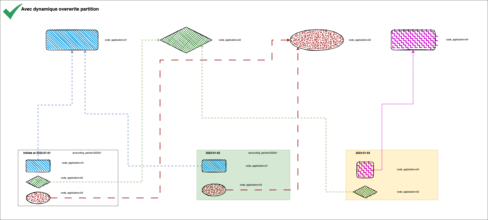

Quand -t-on essaie d'utiliser dynamique partition mode pour écrire des données avec ces deux methods:

```scala
dataframe.write.option("partitionOverwriteMode", "dynamic")
```

ou ajoute dans la configuration de `SparkSession`

```scala
sparkSession.conf.set("spark.sql.sources.partitionOverwriteMode", "dynamic")
```

potentiellement, on rencontre ce genre d'erreur:

> Exception: Caused by: java.io.IOException: PathOutputCommitProtocol does not support dynamicPartitionOverwrite

Il nous suffit desactiver `S3 committer` comme ci-dessous: (si vous êtes sur Cloudera)

```scala
sparkSession.conf.set("spark.sql.sources.commitProtocolClass","org.apache.spark.sql.execution.datasources.SQLHadoopMapReduceCommitProtocol")

sparkSession.conf.set("spark.cloudera.s3_committers.enabled", "false")
```


